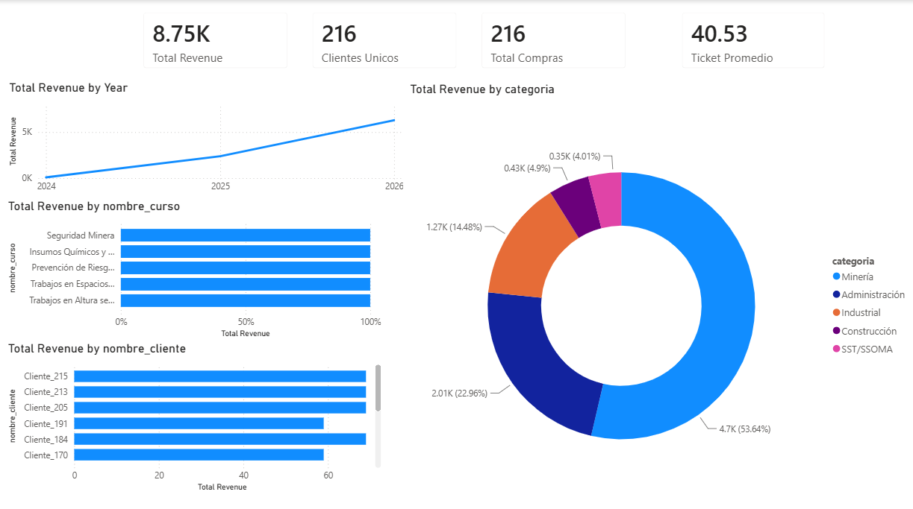

# Sales Analytics Pipeline — Certification Platform

End-to-end analytics pipeline for a course-certification business: data
modeling, SQL analysis, an automated ingestion job, and a Power BI dashboard.

> Built as a portfolio project simulating a real B2B certification platform's
> sales data (clients, courses, purchases, certificates). Data used here is
> synthetic / anonymized — no real client information is included.

## Problem

A certification platform sells online courses across several verticals
(mining, construction, regulatory compliance) to business clients. The
business needed a lightweight, low-cost way to answer:

- Who are the top clients by revenue?
- How is revenue trending month over month?
- Which categories / courses sell best?
- How many clients are repeat buyers (retention)?

## Stack

| Layer            | Tool                              |
|------------------|------------------------------------|
| Database         | PostgreSQL (Supabase, free tier)  |
| Data prep        | Python (pandas)                   |
| Automation       | GitHub Actions (scheduled sync)   |
| Analysis         | SQL                                |
| Visualization    | Power BI (DAX measures)           |

## Architecture

```
CSV export ──▶ PostgreSQL (Supabase) ──▶ SQL views/queries ──▶ Power BI dashboard
                       ▲
                       │
        Python sync script (GitHub Actions, scheduled)
```

## Data model

Five tables, one fact table (`compras`) and four dimension/reference tables:

- **clientes** — buyers (company/individual, sector, city)
- **cursos** — course catalog (hours, modules, category)
- **categoria** — course category lookup (Minería, Administración, Industrial, Construcción, SST/SSOMA)
- **certificados** — issued certificates
- **compras** — fact table: one row per purchase, linking client, course, category, certificate, date, and amount

See [`sql/schema.sql`](sql/schema.sql) for full DDL with constraints and indexes.

## Repository structure

```
infoset-analytics-dashboard/
├── README.md
├── data/sample/          # sample synthetic CSVs (small subset)
├── sql/
│   ├── schema.sql        # table definitions
│   └── queries.sql       # top clients, revenue by month, retention, etc.
├── scripts/
│   └── sync_data.py      # loads new data into Postgres on a schedule
├── .github/workflows/
│   └── sync.yml          # GitHub Actions cron job
└── assets/
    └── dashboard_screenshot.png
```

## Setup / run locally

1. Create a free Postgres instance on [Supabase](https://supabase.com) or [Neon](https://neon.tech).
2. Run the schema:
   ```bash
   psql <your-connection-string> -f sql/schema.sql
   ```
3. Load the sample CSVs (Supabase Table Editor → Import CSV, or `psql \copy`).
4. Explore the analytical queries in `sql/queries.sql`.
5. (Optional) Connect Power BI via the Postgres connector using the same
   connection string, and build measures on top of `compras`.

## Automated sync

`scripts/sync_data.py` checks a source (e.g. a CSV export endpoint or folder)
for new rows and upserts them into `compras`. It runs on a schedule via
GitHub Actions (`.github/workflows/sync.yml`) and sends a notification on
failure.

## Dashboard



Key measures (DAX):
- Total Revenue
- Revenue MoM % Growth
- Repeat Client Rate
- Average Ticket Size

## Author

Built by Stanislav — INCAJATA SAC.
